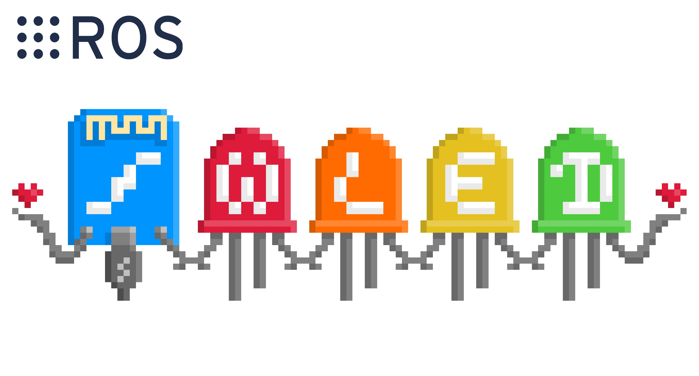

# ros_package_template


## Overview

This is a template repository for a ROS package to use when creating new ROS packages for LMS.
It containts all basic functionality and sets the structure for the package. 
Two template nodes are also provided for both Python and C++ with example code for message/topic exchanging.
Feel free to modify it to your needs.

**Keywords:** ros, package, template, lms



## License 

The source code of this package is not released under any license.

**Author:** Surname Lastname
**Maintainer:** Surname Lastname

## Publications
If you use this work in an academic context, please cite the following publication(s):
- Names: **Title** ([PDF](link))
```
@inproceedings{Name,
    author = {},
    booktitle = {},
    title = {},
    publisher = {},
    year = {}
}
```

## Compatibility

This package has been tested on the following enviroment:

* Ubuntu 18.04
* ROS Melodic

It is possible for it to work on both newer and older versions of the above software, but it is not verified. Please update the documentation upon verification.

## Dependencies

This package only depends on ROS. If you don't already have ROS installed, follow [this guide](http://wiki.ros.org/melodic/Installation/Ubuntu/) for detailed instructions.

You can also install all the ROS package dependencies using `rosdep` inside your workspace: `rosdep install --from-paths src --ignore-src -r -y`

Check the GitHub actions for automated installation scripts.


## Compiling

* Clone this repository inside your source folder of your catkin workspace: `git clone https://github.com/LMS-Robotics-VR/package_template`
* Alternatively you can add this repository as a Git submodule in your existing project: `git submodule add https://github.com/LMS-Robotics-VR/package_template`
* Build the package: `catkin build package_template`

## Running

After sourcing your catkin workspace, you can run: `roslaunch package_template default.launch` to start the node.
You can also use the launch file parameters:

* `config`: Default `$(find package_template)/config/default.yaml`. Loads the provided configuration file to the ROS parameter server.

## Configuring

Use the `config/default.yaml` configuration file to tune the settings of the node based on your needs.

## Interfacing

This package uses the standard ROS interfaces.

### Subscribers

* `/python_subscriber`: `package_template::TemplateMessage`. The subscriber of the Python node.
* `/cpp_subscriber`: `package_template::TemplateMessage`. The subscriber of the C++ node.

### Publishers

* `/cpp_subscriber`: `package_template::TemplateMessage`. The publisher of the Python node.
* `/python_subscriber`: `package_template::TemplateMessage`. The publisher of the C++ node.

### Services

* `/zed_human_tracking/set_state`  `std_srvs::SetBool`. Service for enabling and disabling the node.

* `/python_service`: `package_template::TemplateService`. The service server of the Python node.
* `/cpp_service`: `package_template::TemplateService`. The service server of the C++ node.

## Troubleshooting

Here are some common bugs that were encountered during the development phase.
